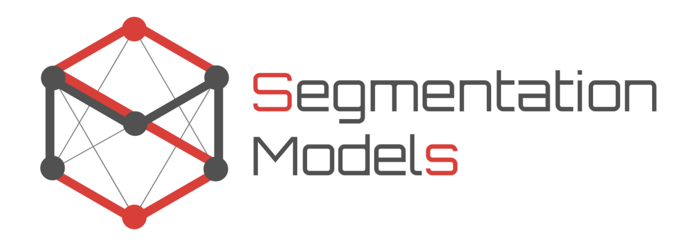

## Hi 👋, I'm Abderaouf Boudia

  
  

### 🚀 Now
- 🔬 AI Engineer at Cedrus Solutions, working on computer vision, real estate analytics, and MLOps.
- 🤖 Passionate about data science, deep learning, computer vision, and signal processing.

### 🎓 Bio
- 📚 Master 2 student in **Traitement de l'information et exploitation de données** at **Télécom SudParis - Université Paris-Saclay**
- 🧠 Graduate in Electronics Engineering from **École Nationale Polytechnique d'Alger**
- 🌱 Continuously learning: **Large Foundation Models**, **Unsupervised Learning**, **Domain Adaptation**, **Model Optimization**

### 🧠 Recent Projects and Publications
- 🛰️ Satellite imagery processing: GPU-optimized **Fast R-CNN** pipeline to detect rooftop energy equipment.
- **WeSegNext**: A memory-efficient unsupervised domain adaptation model improving SAM for segmentation of out-of-domain data.  
  📄 Published in IEEE IGARSS 2025, to be presented in August 2025.  
  🔗 [Read the paper](./Paper_IGARSS_InterSEG.pdf)
- 🧬 Genomic data clustering: Dimensionality reduction via **Median Sparse PCA** and **K-means**.
- 🧍‍♂️ Human motion analytics: Gait classification using SVM/KNN/NN on PhysioNet datasets.  
  📄 Submitted to IEEE Journal of Biomedical and Health Informatics – awaiting review decision.  
  🔗 [Read the paper](./Fall_Risk_Assessment_Using_Gait_Analysis.pdf)
- 🏠 Property valuation: Built ML pipelines predicting property values across France with **XGBoost**, **Random Forest**, and **MLP**.
- 📑 OCR pipeline integration with **FastAPI** and **n8n**, improving document automation flows.

### 💼 Core Skills & Tools
- **Languages**: Python, SQL
- **Frameworks**: PyTorch, TensorFlow/Keras, Scikit-learn, OpenCV, Transformers
- **Data Tools**: Pandas, NumPy, Matplotlib, Seaborn, SHAP, Sweetviz, MLflow
- **DevOps**: Docker, Git, DVC, Azure, FastAPI, n8n
- **Techniques**: Image Segmentation, Signal Processing, NLP, Domain Adaptation, Explainable AI

### 🧰 Daily Tools
  

### 🧪 Libraries Mastered
        

### 🏆 GitHub Stats & Contributions

  
  
  

  

### Connect with me

    
  

