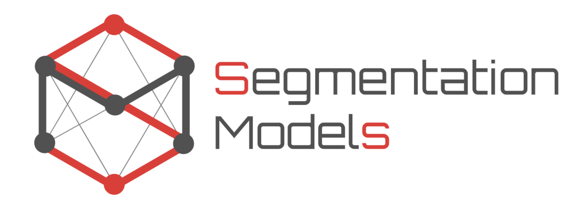
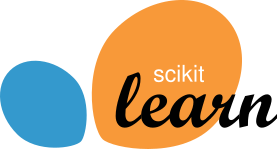

# Abderaouf Boudia

**AI Engineer & Data Scientist**
`LLM Systems · Machine Learning · Deep Learning · Energy Analytics`

I build AI systems that have to survive measurement — document-reading pipelines where
every extracted value carries the sentence that proves it, and learned models that stand
in for physics simulations of building energy. I work at **Cedrus Solutions** (March 2025 →
present), where I designed and built a second-generation retrieval and extraction pipeline
that turns technical building audits into a verifiable structured model. Before that,
computer-vision and biomedical signal-processing research, with two papers.

**[Portfolio](https://boudia-abderaouf.github.io/BOUDIA-Abderaouf/)** ·
**[CV (PDF)](./cv/Abderaouf-Boudia-CV.pdf)** ·
**[LinkedIn](https://www.linkedin.com/in/abderaouf-boudia-4bb166174/)** ·
**[Email](mailto:abderaouf.boudia@gmail.com)**

---

## Current focus

- **Retrieval and structured extraction under verification** — hybrid retrieval, closed
  business vocabularies, deterministic normalisation, and an evidence gate that rejects
  quotations the corpus does not support.
- **LLM evaluation** — per-layer failure attribution, so a missing value is charged to the
  stage that lost it rather than blamed on the model.
- **Deep learning for hourly energy forecasting** — predicting a building's heating and
  cooling load hour by hour. Manuscript planned.

---

## Selected work

Full write-ups in **[`projects/`](./projects)** — problem, engineering decisions,
evaluation, and what I personally built.

#### [Verifiable Document Intelligence for Building Energy Audits](./projects/document-intelligence.md)
`RAG` `structured extraction` `hybrid retrieval` `production`

A layered LLM reading pipeline that turns technical audit PDFs into a verifiable building
model. Exhaustive page coverage instead of a single top-K search; equipment inventory with
per-machine identity; hybrid retrieval (dense + full-text + literal, rank-fused and
depth-laddered); deterministic unit normalisation; and an evidence gate that rejects
quotations the corpus does not support — including retrofit recommendations quoted as if
they were the current state. Every value carries its page, its sentence and the rule that
produced it. ~11k lines, ~3.4k of them tests. Reads a 33-page audit in ~2 min for ~$0.10.

#### [Annual Building Energy Consumption Modeling](./projects/annual-energy-model.md)
`surrogate modeling` `scikit-learn` `Prefect` `MLflow` `production`

A learned stand-in for dynamic thermal simulation: Monte-Carlo building sampling →
orchestrated physics simulation → per-climate-zone neural regressors. Dataset and training
versions are tracked separately, releases are snapshotted into a local registry, and every
release produces an automatic comparison report against the previous one.

#### [Deep Learning for Hourly Building Energy Forecasting](./projects/hourly-energy-forecasting.md)
`PyTorch` `time series` `ongoing research`

Hourly heating and cooling load from building characteristics, operating scenarios and
weather. Building-level stratified splits, 168-hour sampled windows, Huber loss, mixed
precision, resumable multi-hour runs; LSTM and gradient-boosting baselines evaluated
against the production regressor. Evaluated both pointwise and per building, because a
model can be right by the hour and wrong by the season. *Manuscript planned.*

#### [National Building Data Platform](./projects/dbt-data-platform.md)
`dbt` `PostgreSQL` `PostGIS` `analytics engineering`

dbt over the French national building database: staging → intermediate → marts, one
analysis-ready fact table per *département* (~95 builds), GiST spatial indexes created in
post-hooks, generated source declarations, and tests that assert the grain and the
referential contract.

#### [Fall Risk Assessment Using Gait Analysis](./projects/fall-risk-assessment.md)
`signal processing` `scikit-learn` `research — submitted`

A single lower-back accelerometer, four gait-cycle segmentation algorithms compared,
per-cycle time and spatio-temporal features, PCA, and an eight-classifier benchmark on 71
older adults. KNN reaches 89.7 % test accuracy in 0.008 s — statistically level with a deep
network 3,600× slower.

#### [Enhanced Interactive Segmentation for Borehole Images](./projects/interseg-wesam.md)
`computer vision` `SAM` `LoRA` `domain adaptation` `published`

Weakly-supervised source-free adaptation of a segmentation foundation model for corrosion
detection. Error-driven click simulation and dense prompt encoding on top of WeSAM, for a
reported gain of **over 13 IoU points**. IEEE IGARSS 2025.

---

## Research

Author positions reproduce the manuscripts exactly. Index: **[`articles/`](./articles)**.

**Enhanced Foundation Model-Based Interactive Segmentation for Borehole Image Data**
I. Baho\*, E. Ghamgui\*, **A. Boudia**, F. Marchesoni, J. Kherroubi — *third author;
\*the first two contributed equally.*
IEEE IGARSS 2025 · **published** ·
[paper](./articles/Paper_IGARSS_InterSEG.pdf) · [case study](./projects/interseg-wesam.md)

**Fall Risk Assessment Using Gait Analysis and Wearable Sensors: A Machine Learning Approach**
W. Dib, **A. Boudia**, F. Boukhedimi, O. Kerdjidj — *second author.*
Submitted to an IEEE journal · **under review** ·
[manuscript](./articles/Fall_Risk_Assessment_Using_Gait_Analysis.pdf) ·
[case study](./projects/fall-risk-assessment.md)

---

## Experience

**AI Engineer** · Cedrus Solutions, Paris — *March 2025 → present*
Document intelligence and RAG over technical building audits; annual and hourly building
energy models; analytics engineering over national building data. Also GPU-optimised
Fast R-CNN on satellite imagery to detect rooftop energy equipment, and ML pipelines for
property valuation (XGBoost, Random Forest, MLP).

**AI Engineer Intern** · SLB, Clamart — *2024*
Weakly-supervised source-free domain adaptation of segmentation foundation models (SAM,
Vision Transformers, LoRA fine-tuning) for out-of-domain industrial data. → IGARSS 2025.

**Research Intern** · CEDRIC Lab, Paris — *February → April 2024*
Median Sparse PCA for dimensionality reduction on high-dimensional genomic data, assessed
through K-means clustering (cumulative explained variance, Rand index).

**Machine Learning Engineer Intern** · CDTA / École Nationale Polytechnique, Algiers — *February → July 2023*
Gait analysis from a single inertial measurement unit: signal processing, gait-cycle
segmentation, feature extraction, classifier benchmarking. → fall-risk manuscript.

**Deep Learning Engineer Intern** · CDTA, Algiers — *July → October 2022*
1D CNN for human-activity recognition and fall detection, converted to TensorFlow Lite and
deployed on an Arduino Nano 33 BLE with onboard inertial sensors.

### Education

- **M2, Information Processing and Data Exploitation** — Télécom SudParis, Université
  Paris-Saclay · 2023 – 2024
- **State Engineer + Master's, Electronics Engineering** — École Nationale Polytechnique
  d'Alger · 2020 – 2023
- **Preparatory classes (CPGE), science and technology** — École Nationale Polytechnique ·
  2018 – 2020 · ranked 81st of 1,961 at the national entrance exam

---

## Technical expertise

**AI engineering** — RAG · hybrid retrieval (dense, full-text, literal) · rank fusion and
reranking · structured extraction · grounding and evidence validation · LLM evaluation and
benchmarking · prompt engineering · Pydantic · LLM APIs (OpenRouter, Gemini-class models)

**Machine learning** — scikit-learn · XGBoost · random forests · SVM / KNN · feature
engineering · PCA · hyperparameter optimisation · time-series forecasting · surrogate
modeling · model evaluation and error analysis · SHAP

**Deep learning** — PyTorch · PyTorch Lightning · TensorFlow / Keras · TensorFlow Lite ·
MLP · CNN · LSTM · semantic and instance segmentation · foundation models (SAM) · LoRA ·
domain adaptation · mixed-precision training

**Data & analytics engineering** — PostgreSQL · PostGIS · pgvector · SQL · dbt ·
Parquet / PyArrow · pandas · NumPy · data pipeline design

**MLOps & cloud** — MLflow · Prefect · Docker · pytest · Git · DVC · TensorBoard · Poetry ·
AWS (Lambda, S3, DynamoDB) · Azure · dataset and model versioning · model registries

**Scientific & domain** — building energy modeling · dynamic thermal simulation ·
geospatial data and remote sensing · biomedical signal processing · computer vision

**Languages** — Python · SQL · C/C++ · MATLAB · R

### Stack

**AI & LLM**

**Machine learning & deep learning**

**Data**

**MLOps & cloud**

### Libraries I work with daily

           

### Daily tools

     

